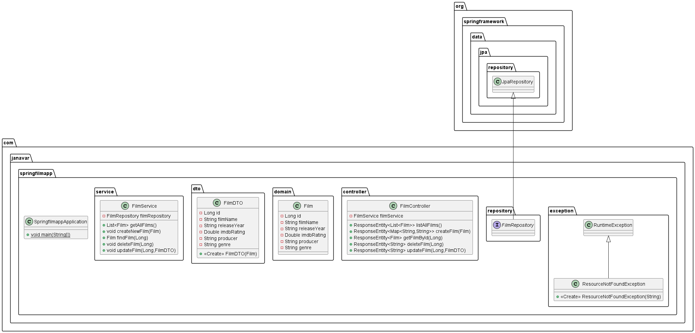

# Spring Boot Film Projesi

Bu proje, Spring Boot kullanarak basit bir film bilgisi yönetim uygulamasını oluşturmayı amaçlamaktadır. Proje, tek bir
POJO sınıfı içerir. CRUD (Create, Read, Update, Delete) operasyonları uygulanmıştır.

## Bağımlılıklar


## UML Diagramı


## Film Sınıfı

Bu sınıfın nitelikleri aşağıdaki gibidir.

* `id` : **Long** türünde filmin benzersiz idsi.
* `filmName` : **String** filmin adı.
* `releaseYear` : **String** Filmin yapım yılı.
* `imdbRating` : **Double** Filmin imdb puanı.
* `producer` : **String** Filmin yapımcısı.
* `genre` : **String** Filmin türü.

## FilmService

CRUD operasyonlarını gerçekleştiren bir servis sınıfıdır.

## FilmController

HTTP isteklerini karşılayan bir kontrolör sınıfıdır. FilmService'i kullanarak CRUD operasyonlarını çağırır.

## FilmRepository

FilmRepository, film nesnelerini depolamak ve çeşitli veritabanı işlemlerini gerçekleştirmek için kullanılır. Bu
repository, Spring Data JPA tarafından sağlanan özellikleri kullanarak veritabanı ile etkileşimde bulunur.

## API Endpoint'leri

- Film Listesi:
    - Path: /films
    - Method: GET
    - Açıklama: Tüm filmleri listeler.

- Film Detayı:
    - Path: /films/{filmId}
    - Method: GET
    - çıklama: Belirli bir filmi getirir.

- Film Ekleme:
    - Path: /films
    - Method: POST
    - Açıklama: Yeni bir film ekler.

- Film Güncelleme:
    - Path: /films/{filmId}
    - Method: PUT
    - Açıklama: Belirli bir filmi günceller.

- Film Silme:
    - Path: /films/{filmId}
    - Method: DELETE
    - Açıklama: Belirli bir filmi siler.

### Örnek JSON

```
[
  {
    "filmName": "Interstellar",
    "releaseYear": "2014",
    "imdbRating": 8.6,
    "producer": "Christopher Nolan",
    "genre": "Science Fiction"
  },
  {
  "filmName": "The Shawshank Redemption",
  "releaseYear": "1994",
  "imdbRating": 9.3,
  "producer": "Frank Darabont",
  "genre": "Drama"
  },
  {
    "filmName": "Inception",
    "releaseYear": "2010",
    "imdbRating": 8.8,
    "producer": "Christopher Nolan",
    "genre": "Action, Adventure, Sci-Fi"
  },
  {
  "filmName": "The Godfather",
  "releaseYear": "1972",
  "imdbRating": 9.2,
  "producer": "Francis Ford Coppola",
  "genre": "Crime"
  },
  {
    "filmName": "The Shawshank Redemption",
    "releaseYear": "1994",
    "imdbRating": 9.3,
    "producer": "Frank Darabont",
    "genre": "Drama"
  }
]


```